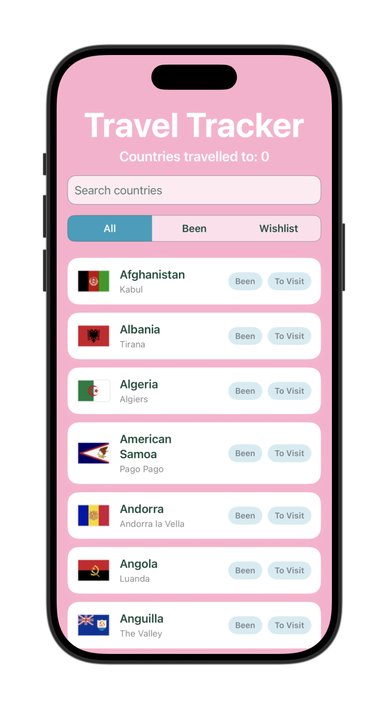
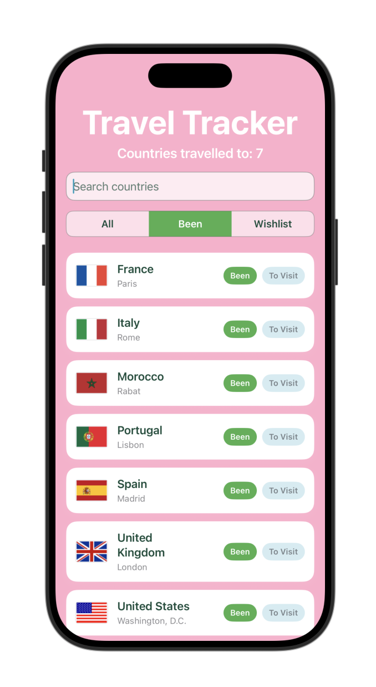
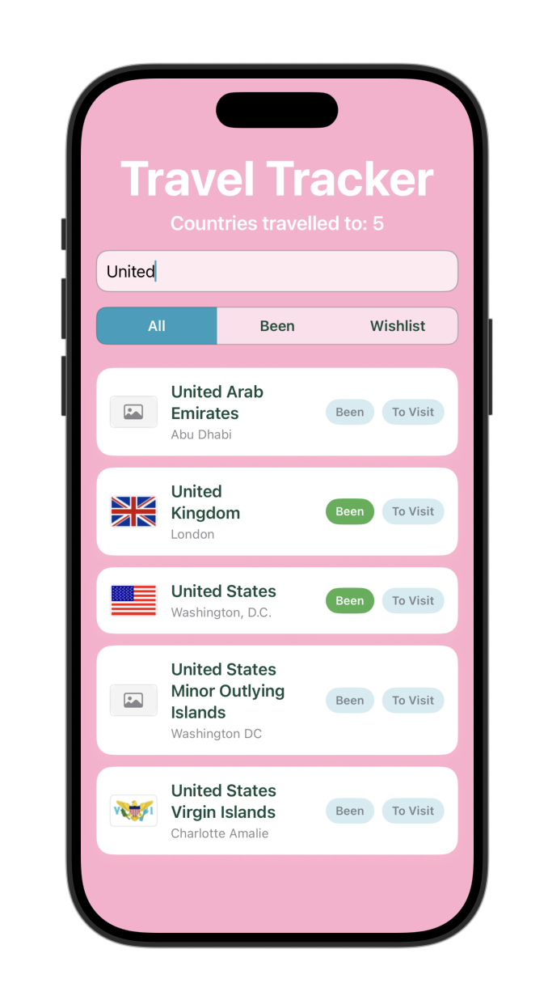
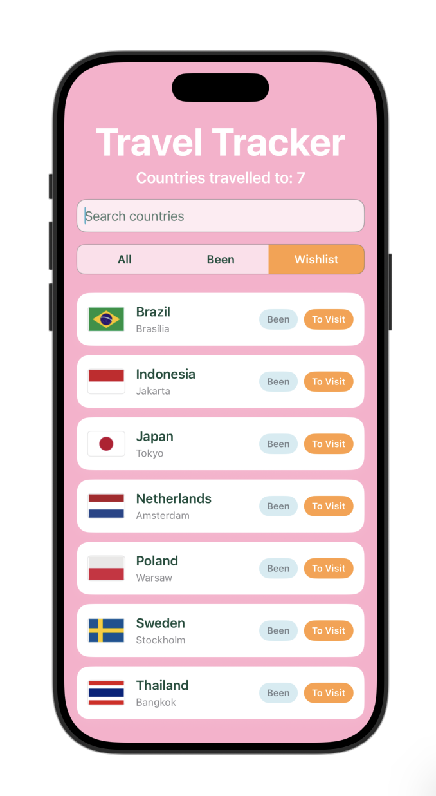
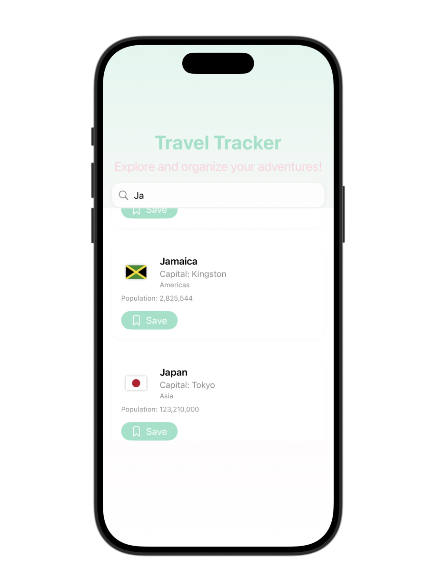
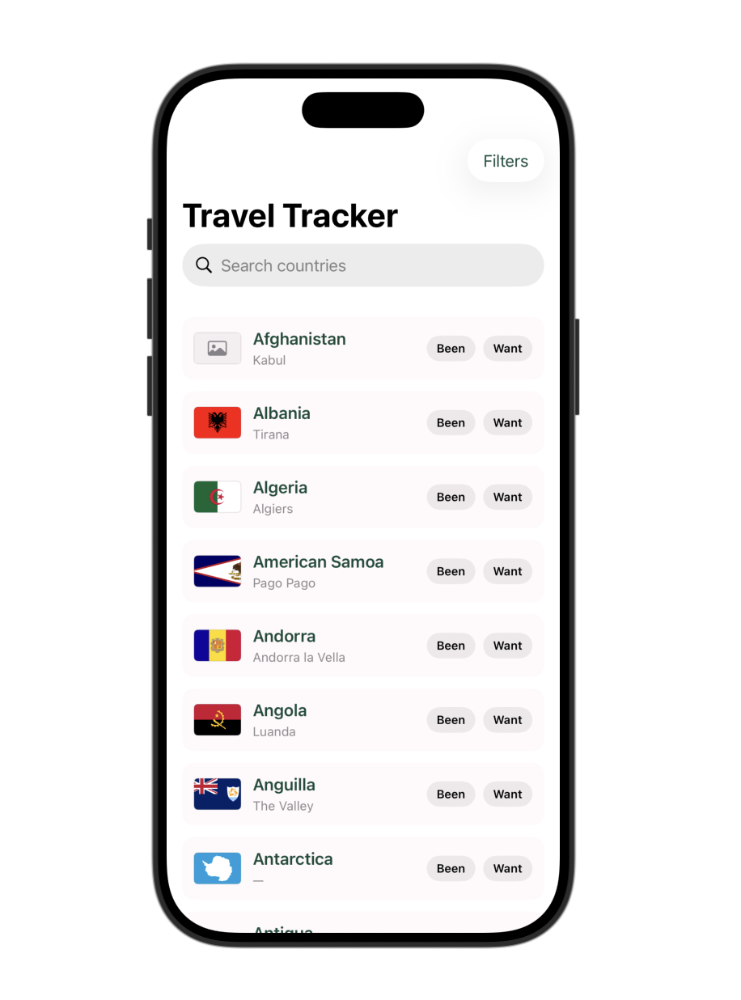
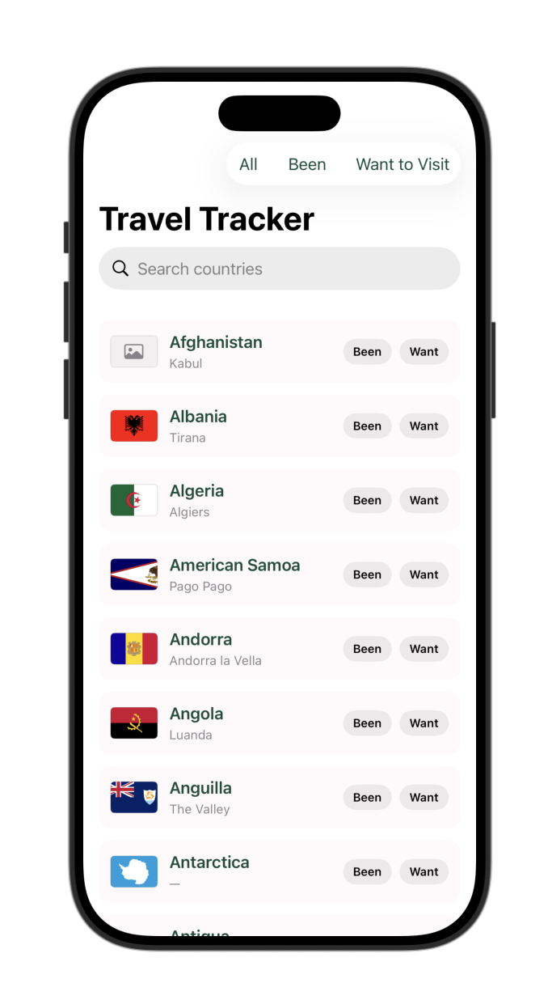
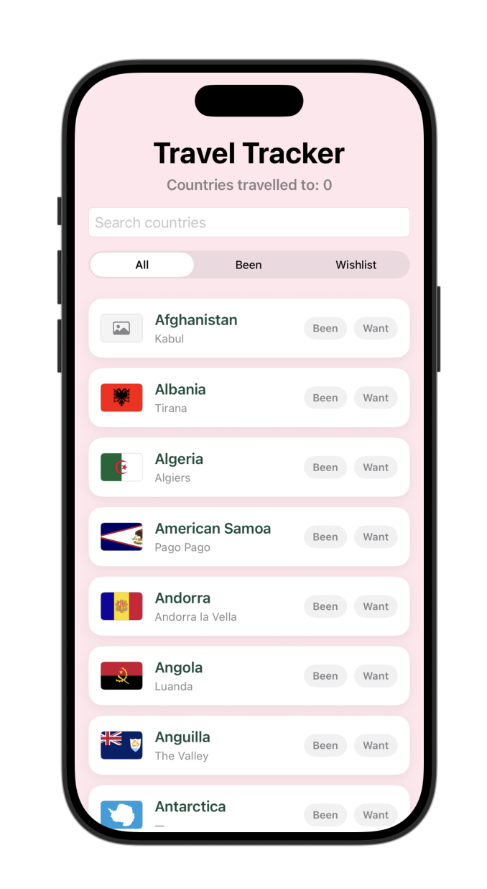

#  Travel Tracker
Travel Tracker is a clean and colorful SwiftUI app for exploring countries and keeping track of where you’ve been and where you want to go. It pulls real-time country data and displays it in an easy-to-browse list with quick save actions, search, and simple filtering.

## Screenshots

### Final Screens

#### All Countries

#### Been Countries

#### Search

#### Wishlist

### Iterations

#### Iteration 1

#### Iteration 2

#### Iteration 3

#### Iteration 4

## Features of App
- Browse a full list of countries with flags, capitals, and regions
- Search countries by name in real time
- Mark countries as “Been To” or “Want to Visit”
- Toggle saved states directly from the main list
- Filter countries by All, Been, or Wishlist
- View detailed country information
- Optionally add a visit date for countries you’ve been to
- Clean card-based UI with soft colors and rounded elements

## Built With
- SwiftUI
- REST Countries API (https://restcountries.com/)
- Flags API (https://flagsapi.com/)
- Xcode

## Instructions for Setup
- Clone or download this repository.
- Open Travel-Tracker.xcodeproj in Xcode.
- Select an iPhone Simulator.
- Press Run to build and launch the app.

No API keys are required. The app fetches public country and flag data at runtime.
